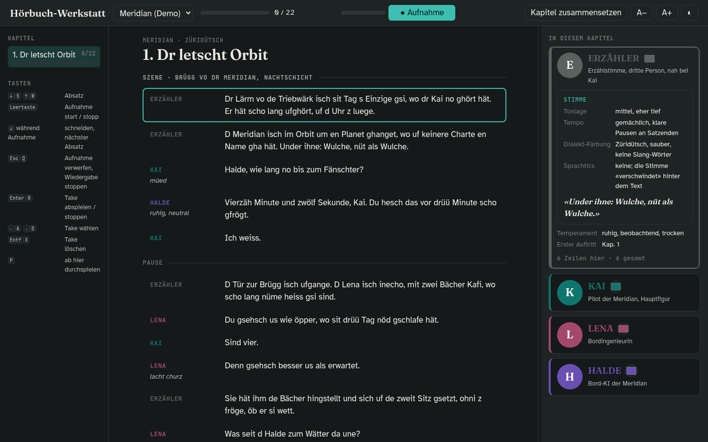

# Hörbuch-Werkstatt



Turn a German novel into a Swiss German audiobook recording script, one chapter at a time, with an AI assistant doing the translation and a local web page as your recording companion.

**What it does**

- Continues *your* Swiss German translation style (you translate the first pages, the assistant matches your dialect).
- Outputs each chapter as a **script**: every paragraph tagged with its speaker, stage directions, and `(?)` flags where the speaker is ambiguous.
- Keeps a **Steckbrief** (character sheet) per character with voice notes: pitch, tempo, dialect colouring, verbal tics, a reference line.
- Serves a **recording studio** page: record every paragraph from the browser, keep several takes, pick the best, assemble the chapter into one WAV plus an Audacity label track. Colour-coded speakers, character sheets with photo, colour and voice notes, Chinese name pronunciation, all keyboard-driven.

Books are copyrighted. For every book only the character sheets, photos, glossary and name table are tracked; originals, translated scripts, the style sample and recordings are git-ignored. `buecher/_beispiel/` is a fictional demo and fully tracked.

## Layout

```
buecher/
  _vorlage/        template for a new book
  _beispiel/       fictional demo book "Meridian" (Swiss German)
  <your-book>/     git-ignored
    buch.md        metadata (title, author, dialect)
    original/      EPUB/PDF + extracted chapters, never committed
    stil/          beispiel.md (your sample translation), glossar.md
    skript/        kapitel-NN.md, the recording scripts
    figuren/       NAME.md, one Steckbrief per character
    audio/         takes per chapter (wav + takes.json), assembled chapter wav + labels
app/
  index.html       recording UI (served by tools/serve.py; read-only when opened as a file)
  data.js          generated by tools/build.py for the read-only mode, git-ignored
tools/
  serve.py         local server: recording API, ffmpeg assembly, name TTS (needs ffmpeg)
  say.sh           speak a Chinese name aloud (needs `pipx install edge-tts`, ffplay)
  extract_epub.py  EPUB -> original/text/NNN-*.md (plain text per section)
  build.py         buecher/ -> app/data.js
CLAUDE.md          instructions for the AI assistant (pipeline, formats)
```

## Add a book

```sh
cp -r buecher/_vorlage buecher/mein-buch
# drop the EPUB into buecher/mein-buch/original/
python3 tools/extract_epub.py buecher/mein-buch/original/mein-buch.epub
# write your sample translation into buecher/mein-buch/stil/beispiel.md
python3 tools/serve.py        # then open http://localhost:8765
```

## Recording

Space starts and stops a take on the current paragraph, arrows or WASD move and pick takes, Enter plays, Delete removes. Paragraphs with a chosen take turn green. "Kapitel zusammensetzen" writes `audio/kapitel-NN/kapitel-NN.wav` and `kapitel-NN.labels.txt`; open the WAV in Audacity and use File → Import → Labels to get every paragraph as a movable, named region.

Every take is denoised with RNNoise (`tools/models/sh.rnnn`, ffmpeg `arnndn`) and trimmed of leading/trailing silence; the raw recording is kept next to it, `python3 tools/serve.py reprocess` recomputes all takes after changing settings at the top of `tools/serve.py`.

Requirements: Python 3, ffmpeg, a Chromium- or Firefox-based browser. Optional: `pipx install edge-tts` for Chinese name playback.

Then ask the assistant: *"Übersetz Kapitel 1 vo mein-buch"*.

Character sheets live in `figuren/NAME.md`; add `- Farbe: #hex`, `- Zeichen: 叶哲泰` and a `NAME.jpg` next to it for colour, pronunciation and photo in the UI.

## Remove a book

Delete its folder and rerun `python3 tools/build.py`.

## Script format

```
## Kapitel 3 – Dr Absprung

[SZENE: Brügg vo dr Meridian, Nacht]

ERZÄHLER: Dr Lärm vo de Triebwärk isch ...

KAI (flüsternd): Mir händ kei Ziit meh.

LENA (?): Wer seit das?

[PAUSE]
```

See `CLAUDE.md` for the full spec.

## License

MIT. Do not commit copyrighted books. `tools/models/sh.rnnn` is an RNNoise model from [GregorR/rnnoise-models](https://github.com/GregorR/rnnoise-models) (BSD).
